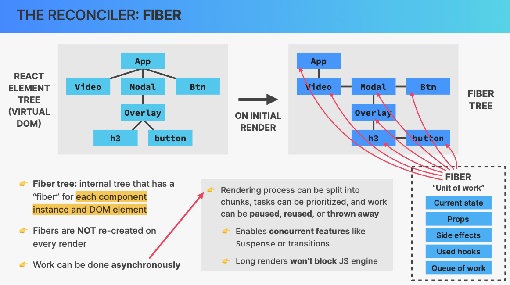

# usePopcorn

## HOW TO SPLIT A UI INTO COMPONENTS


## WHAT IS COMPONENT COMPOSITION?


## HOW REACT WORKS BEHIND THE SCENES

### COMPONENT VS. INSTANCE VS. ELEMENT


#### React.createElement

`React.createElement()` is a basic function for creating React elements — the things you see in JSX. Behind the scenes, the code you write in JSX is actually being transformed into calls to `React.createElement()`.

This function accepts three parameters:

1. `type`: A string (corresponding to the name of a native DOM tag) or a function (corresponding to a React component).

2. `props`: An object containing the props to pass to the component, or attributes for the DOM element.

3. `children`: The children of the component. This could be any valid React child, such as a string, a React element, or an array of these types.

For example, if you write this in JSX:

```jsx
<div className="myClass">Hello World!</div>
```

Behind the scenes, this JSX is being transformed into:

```javascript
React.createElement("div", { className: "myClass" }, "Hello World!");
```

These two pieces of code do the same thing: they both create a div element with the class "myClass" and the text "Hello World!".

While you can use `React.createElement()` directly, most of the time we use JSX because its syntax is more similar to HTML and it's more readable and writeable.


### HOW RENDERING WORKS


#### Rendering trigger


1. Component tree = Component instance Tree
2. React element tree = Virtual DOM(cheap and fast which are just js objects)
3. Trigger rendering leads to the update of component (instance) tree,and then results in the update of corresponding virtual dom and its children.


#### WHAT IS RECONCILIATION AND WHY DO WE NEED IT?



The Fiber tree in React is essentially a representation of the component hierarchy. Each node in the tree corresponds to a React element - it could be a DOM element (like a div or span) or a user-defined component. This is called a "fiber node" or just a "fiber".

When React renders an application, it constructs this Fiber tree as a step in the rendering/reconciliation process. This tree is used to keep track of the work that needs to be done to update the DOM.

Here are the key points to understand about the Fiber tree:

1. **Fiber Node**: Each Fiber node contains information about a React element, including its type (e.g. div, span, etc.), its props, and the state it returns.

2. **Tree Structure**: The Fiber tree mirrors the structure of the DOM tree but also includes class and function components. Each Fiber node has a link to its first child, its next sibling, and its parent. This helps React traverse the nodes in the tree.

3. **Double Buffering**: React maintains two trees - the current tree and the work-in-progress tree. The current tree represents the state of the UI, and the work-in-progress tree is where React performs the updates. When the updates are ready, React switches the two trees.

4. **Unit of Work**: Each Fiber in the tree represents a unit of work. React traverses the Fiber tree and performs the work associated with each Fiber. This could be rendering a new element, updating an existing one, or deleting an element.

5. **Priority**: Each unit of work (Fiber) has a priority level. This is used by React to determine which work needs to be done first.

6. **Incremental Updates**: Fiber allows React to split up the rendering process into small chunks and spread out the work over multiple frames. This prevents long-running tasks from blocking the main thread and keeps the application responsive.
